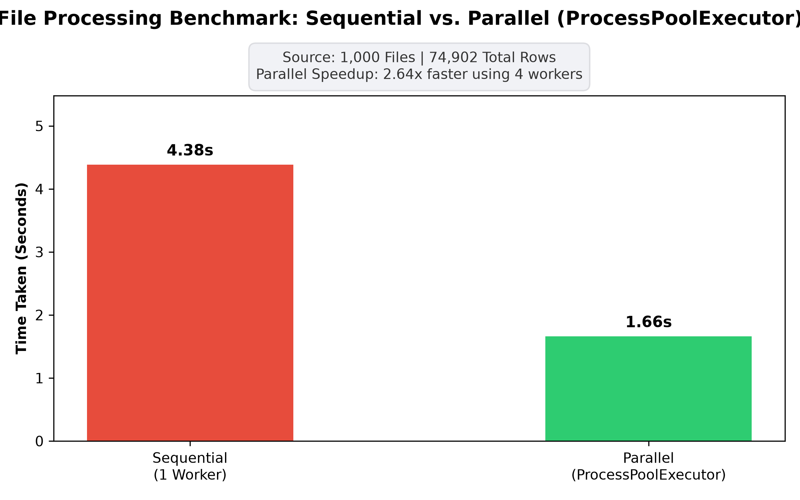

# 🚀 IoT Log Processor: Sequential vs. Parallel Benchmark

This project demonstrates how to process high-volume IoT log files in Python by comparing traditional **sequential (1-by-1)** execution against **multi-core parallel processing** using Python's built-in `concurrent.futures.ProcessPoolExecutor`.

---

## 📁 Repository File Structure

* **`generate_iot_logs.py`** Generates synthetic raw CSV files containing IoT device telemetry logs (timestamp, device ID, status, error code, voltage, current draw).

* **`process_sequential.py`** Reads, filters out `'OK'` records, transforms metrics (voltage $\times$ current = power in watts), and aggregates output file-by-file sequentially on a single CPU core (`MainProcess`).

* **`process_parallel.py`** Executes the exact same ETL pipeline as `process_sequential.py`, but distributes file processing across multiple CPU worker processes concurrently using `ProcessPoolExecutor`.

* **`benchmark_and_visualize.ipynb`** Loads the generated output files, extracts millisecond-accurate `load_timestamp` spans, calculates overall execution times, and outputs a benchmark comparison chart.

* **`iot_logs/`** *(Generated Directory)* Contains all generated input CSV log files.

* **`processed_output.csv` / `processed_output_seq.csv`** *(Generated Output)* The final consolidated CSV files produced by parallel and sequential runs, respectively.

---

## 📈 Benchmark Summary

Below is the execution time comparison visual generated by running `benchmark_and_visualize.py`:

